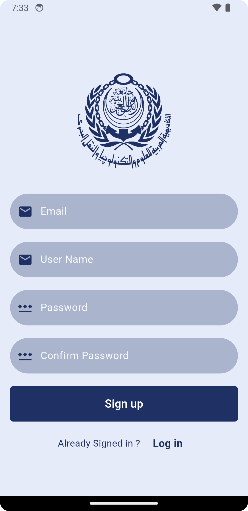

# College System - Flutter Project

This Flutter project is a college system application consisting of five main pages. The project integrates Firebase Authentication, an external API (Mocky), and Firebase Realtime Database to provide a seamless user experience.

## Features

- **Login Page**: Allows users to log in with their credentials using Firebase Authentication.
  
  !

- **Sign Up Page**: Enables new users to create an account with Firebase Authentication.

  !

- **PhD Programs Page**: Displays a list of available PhD programs. (Data fetched from Mocky API)

  !

- **Details Page**: Provides detailed information about the selected PhD program. It contains a button in the top-right corner that navigates to the Degrees page.

  !

- **Degrees Page**: Uses Firebase Realtime Database for data handling and display.

  !


## Project Structure

- **Login & Sign Up Pages**: Utilize Firebase Authentication for user registration and login.
- **PhD Programs & Degrees Pages & Details page**: Fetch data from the Mocky API to display program and degree details & Communicates with Firebase Realtime Database to store and retrieve information.. 


## Dependencies

This project uses the following dependencies:

- `firebase_auth`: For Firebase Authentication
- `firebase_core`: Firebase SDK for Flutter core functionalities
- `cloud_firestore`: For Firebase Realtime Database integration
- `http`: To handle API requests to the Mocky API

Make sure to add these dependencies in your `pubspec.yaml` file.

## Installation

1. Clone the repository:
    ```bash
    git clone https://github.com/your-username/college-system-flutter.git
    ```
2. Navigate to the project directory:
    ```bash
    cd college-system-flutter
    ```
3. Install the required dependencies:
    ```bash
    flutter pub get
    ```
4. Set up Firebase:
   - Create a Firebase project and enable **Firebase Authentication** (Email/Password) and **Firebase Realtime Database**.
   - Download the `google-services.json` file and place it in the `android/app` directory.
   - Follow Firebase documentation to set up the project for Flutter.

5. Run the project:
    ```bash
    flutter run
    ```

## API Information

The PhD programs and degrees pages use data fetched from the Mocky API. The API endpoints are configured within the project, and you can modify the endpoint if needed.

## Firebase Setup

Ensure you have properly configured Firebase for the following services:

- **Firebase Authentication**: Used for user login and registration.
- **Firebase Realtime Database**: Used for storing and retrieving data on the final page.

Follow the [official Firebase documentation](https://firebase.google.com/docs/flutter/setup) to complete the setup.

## Contributing

Contributions are welcome! Feel free to fork the repository and submit pull requests for any improvements or fixes.

## License

This project is licensed under the MIT License. See the `LICENSE` file for more details.

